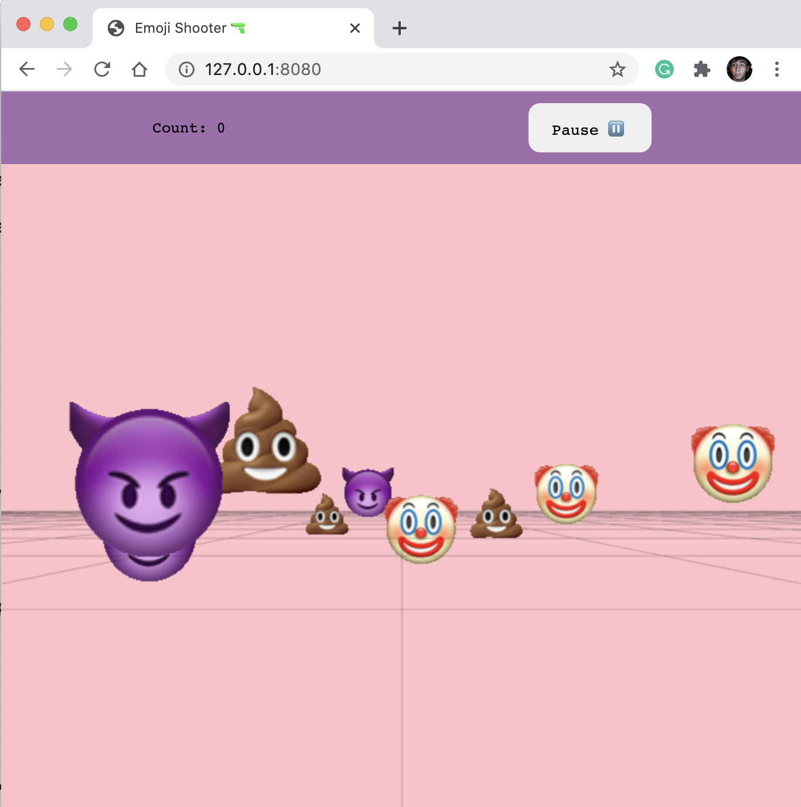

# emoji-shooter
игра, в которой нужно отстреливать различные летающие эмоджи 😈

собственно, приложение имеет максимально простую структуру:

viewer.js - отвечает за сцену, это api, которое предоставляет для всех пользователей этой зависимости следующее:
- рисовать
- управлять камерой
- светом
- рейкастером

engine.js - отвечает за логику игры:
- создание объектов
- выстрелы
- уничтожение объектов при попадании
- звуки
- набор очков
- проигрыш
- старт-паузу-стоп.

этот слой принимает сигналы с контролов и посылает сигналы во вьювер.

controls.js - слой, который слушает пользовательские события и имеет событийную систему. создан для того, чтобы игровая логика, помещённая в engine могла тригерить реакции на действия пользователя.

raycaster.js - по сути промежуточный слой между контролами и движком, имеет api для выборки объектов по координатам, имеет фильтрацию по типам объектов, может искать в каком-то конкретном пространстве (по дефолту сцена).
