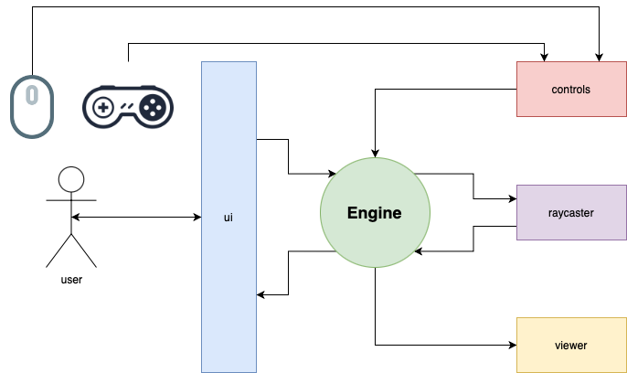

# emoji-shooter

A minimalistic first-person shooter in which you have to shoot emojis flying at you. 😈

> ℹ️ Based on the classic webdev stack (html/css/js) and three.js library.

---

## Structure

### index.js (ui)

The upper level of the architecture, contains the initialization and launch code
as well as for managing various states of the ui part (buttons, labels, etc.).

### engine.js

Responsible for the game logic:

- creating enemies
- firing shots
- destruction of enemies on hit
- calculation of points for hits
- game over conditions
- game control: start-pause-stop

This layer receives events from controls and call methods of the viewer.

### controls.js

A layer that listens events from the different input sources and has an event system.

### viewer.js

API for working with the 3D part of the system:

- creating and deleting objects
- camera movement control
- lighting control on scene

### raycaster.js

API for selecting objects by coordinates, has filtering by object types,
can search in a specific space (scene by default).

---

## Schema

See the schema for more details:

